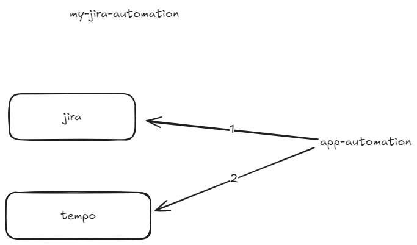

# my-jira-automation
Automate my JIRA issue creation

## First Draft Architecture


## Description
This project automates the creation of JIRA issues and logs time to Tempo. It leverages an LLM (Large Language Model) to
generate titles and descriptions for the tickets, creating a streamlined workflow to save time.

## Steps
1. Request LLM to generate a title/description for tickets.
2. Log the ticket to JIRA.
3. Log time to Tempo.
4. Enjoy 15 minutes of my time saved every working week 😂

## Prerequisites
Ensure you have the following installed:

- Python 3.10.11
- Packages: PyYAML, pip, requests, wheel

## Installation for development
### Clone the repository:
```sh
git clone <your-repo-url>
cd my-jira-automation
```

### Install the required packages:
```sh
pip install -r requirements-dev.txt
```

## Deploy on AWS lambda
### Packaging
```shell
mkdir package
pip install -r requirements.txt -t package/
cp -r my_jira_automation/* package/
cd package
zip -r ../lambda_function.zip .
```

##### Upload Code


## Usage
1. Configure your JIRA and Tempo API settings in a configuration file inside `resources/config.yaml`
2. Run the main script to start the automation process:
```sh
python main.py
```

## TODO
- ~~Use LLM to generate prompt to log JIRA ticket with summary and description~~
- ~~Use Tempo API to log time on ticket created~~
- ~~Create JIRA ticket~~
- ~~Create Tempo for the current week~~
- Add Skipping holiday
- Aws secretmanager integration
- ~~Add more comments docstring~~
- ~~Schedule it with aws (eventbridge lambda)~~

## License
This project is licensed under the MIT License—see the [LICENSE](LICENSE) file for details.